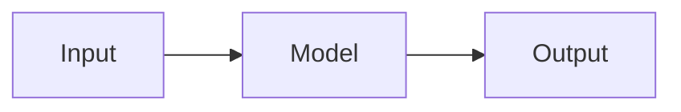

# fiqlab

Personal research portfolio and blog built with Next.js 15. Features academic publications, project portfolio, technical blog with interactive diagrams, Mapbox 3D maps, and email contact via Resend.

**Live:** [fiqlab.vercel.app](https://fiqlab.vercel.app) &nbsp;·&nbsp; **Author:** [Taufiqurrahman](https://github.com/fiqgant)

---

## Tech Stack

| Layer | Library |
|---|---|
| Framework | Next.js 15 (App Router, Turbopack) |
| Language | TypeScript |
| Styling | Tailwind CSS v3 |
| Blog | MDX via `next-mdx-remote` v6 |
| Syntax highlight | `rehype-pretty-code` + Shiki |
| Diagrams | Mermaid JS (client-side render) |
| 3D Background | Three.js (neural network particle field) |
| Map | Mapbox GL JS (3D globe with auto-rotation) |
| Email | Resend |
| Search | Fuse.js (fuzzy search) |
| Math | KaTeX |
| Icons | Lucide React |
| State | Zustand |
| Animations | Framer Motion |

---

## Features

- **Blog** — MDX with syntax highlighting, Mermaid diagrams, KaTeX math, reading time, table of contents, tag filtering
- **Publications** — synced from Google Scholar via SerpAPI with local cache
- **Portfolio** — project showcase with GitHub stats
- **About** — profile, academic stats, interactive Mapbox 3D map
- **Contact** — Resend-powered email form + full-height Mapbox map side by side
- **Tools & Skills** — icon grid with glow hover effect, category filter, Software/Hardware tabs
- **Hero** — animated Three.js neural network particle background with mouse parallax
- **Search** — fuzzy full-text search across blog posts and publications
- **Dark mode** — system-aware via `next-themes`

---

## Getting Started

### 1. Clone and install

```bash
git clone https://github.com/fiqgant/fiqlab.git
cd fiqlab
npm install --legacy-peer-deps
```

### 2. Set up environment variables

```bash
cp .env.local.example .env.local
```

Edit `.env.local`:

```env
# Mapbox — get a free token at mapbox.com
NEXT_PUBLIC_MAPBOX_TOKEN=pk.your_token_here

# Site URL (for OG tags and SEO)
NEXT_PUBLIC_SITE_URL=https://yourdomain.com

# SerpAPI — for Google Scholar sync
SERPAPI_KEY=your_serpapi_key
GOOGLE_SCHOLAR_AUTHOR_ID=your_author_id

# GitHub username — for portfolio stats
GITHUB_USERNAME=your_username

# Resend — for contact form email delivery (resend.com)
RESEND_API_KEY=re_your_api_key
CONTACT_TO_EMAIL=you@yourdomain.com

# Feature flags
NEXT_PUBLIC_SHOW_SYNC=true
```

### 3. Run development server

```bash
npm run dev
```

Open [http://localhost:3000](http://localhost:3000).

---

## Project Structure

```
fiqlab/
├── app/                        # Next.js App Router pages
│   ├── about/                  # About page with Mapbox map
│   ├── api/contact/            # Resend email API route
│   ├── api/github/             # GitHub stats API
│   ├── api/publications/       # Publications API
│   ├── api/search/             # Search API
│   ├── blog/[slug]/            # Blog post detail
│   ├── blog/                   # Blog listing with tag filter
│   ├── contact/                # Contact form + Mapbox map
│   ├── portfolio/              # Project portfolio
│   ├── publications/           # Academic publications
│   └── tools/                  # Tools & skills showcase
│
├── components/
│   ├── blog/                   # BlogCard, MDXContent, MermaidDiagram, TOC
│   ├── contact/                # ContactForm (Resend integration)
│   ├── hero/                   # Three.js neural network background
│   ├── map/                    # Mapbox 3D map (reusable)
│   ├── publications/           # Publication cards
│   ├── search/                 # Search modal (Fuse.js)
│   ├── tools/                  # ToolsClient with icon grid
│   └── ui/                     # Navbar, Footer
│
├── content/blog/               # MDX blog posts
├── data/                       # Personal info, publications, portfolio, tools
├── lib/                        # Blog loader, Scholar sync, rehype plugins
└── .github/workflows/          # CI, Lighthouse, Scholar sync
```

---

## Writing a Blog Post

Create a new file in `content/blog/your-post-slug.mdx`:

````markdown
---
title: "Your Post Title"
date: "2025-01-01"
excerpt: "A short description shown in listings."
thumbnail: "https://images.unsplash.com/..."
tags: ["Deep Learning", "Tutorial"]
category: "Research"
featured: true
---

Your content here. Supports:

- GFM tables, strikethrough, task lists
- Syntax-highlighted code blocks
- KaTeX math: `E = mc²`
- Mermaid diagrams:


````

---

## GitHub Actions

| Workflow | Trigger | Purpose |
|---|---|---|
| `ci.yml` | Push / PR to main | Build + lint + type check |
| `lighthouse.yml` | After Vercel deploy | Performance / SEO audit |
| `scholar-sync.yml` | Every Sunday 00:00 UTC | Refresh Google Scholar cache |

---

## Customization

Edit `data/personal.ts` to update name, bio, location, social links, and research interests.

Edit `data/publications.ts` as a local fallback if SerpAPI is not configured.

Edit `data/portfolio.ts` to manage projects manually.

Edit `data/tools.ts` to add or update skills and tools.

---

## Deployment

The project is ready to deploy on **Vercel** with zero configuration.

```bash
vercel --prod
```

Add all environment variables from `.env.local` to your Vercel project settings. Make sure to set **Node.js version to 22.x** in Vercel → Settings → General.

---

## License

MIT
