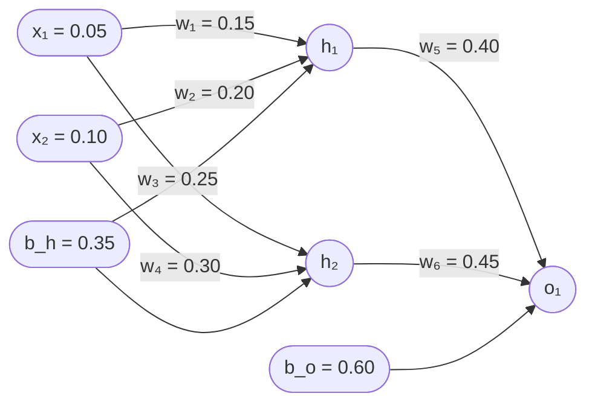
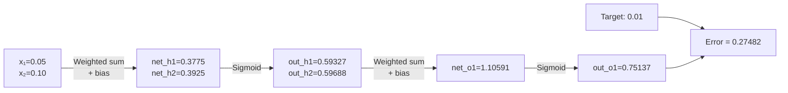
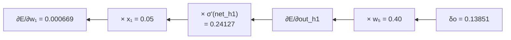
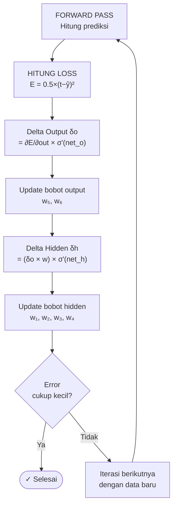
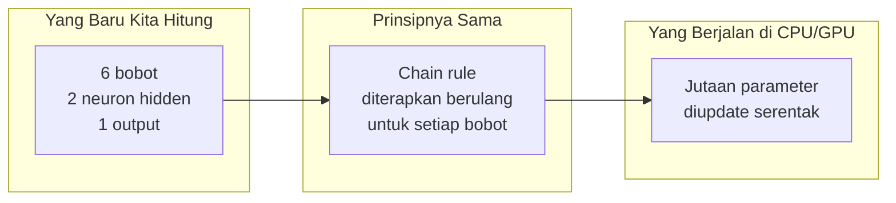

Backpropagation adalah jantung dari semua neural network modern. Tapi kebanyakan tutorial melewatinya dengan notasi matriks yang abstrak. Di artikel ini kita akan **menghitung satu per satu**, digit per digit, sehingga tidak ada satu langkah pun yang tersembunyi.

## Setup Jaringan

Kita akan menggunakan jaringan sederhana: **2 input → 2 hidden → 1 output**, dengan aktivasi Sigmoid di semua neuron.



### Nilai Awal

| Simbol | Nilai | Keterangan |
|---|---|---|
| x₁ | 0.05 | Input 1 |
| x₂ | 0.10 | Input 2 |
| t₁ | 0.01 | Target output |
| η | 0.50 | Learning rate |
| w₁ | 0.15 | x₁ → h₁ |
| w₂ | 0.20 | x₂ → h₁ |
| w₃ | 0.25 | x₁ → h₂ |
| w₄ | 0.30 | x₂ → h₂ |
| b_h | 0.35 | Bias hidden layer |
| w₅ | 0.40 | h₁ → o₁ |
| w₆ | 0.45 | h₂ → o₁ |
| b_o | 0.60 | Bias output layer |

### Fungsi Aktivasi Sigmoid

```
σ(x) = 1 / (1 + e^(−x))
```

Turunannya sangat elegan — bisa dinyatakan dalam output-nya sendiri:

```
σ'(x) = σ(x) · (1 − σ(x))
```

---

## Bagian 1 — Forward Pass

Forward pass adalah proses menghitung prediksi dari input ke output.

### Langkah 1.1 — Hidden Neuron h₁

Hitung **net input** (weighted sum):

```
net_h1 = (w₁ · x₁) + (w₂ · x₂) + b_h
       = (0.15 × 0.05) + (0.20 × 0.10) + 0.35
       = 0.0075 + 0.0200 + 0.3500
       = 0.3775
```

Terapkan fungsi aktivasi Sigmoid:

```
out_h1 = σ(0.3775)
       = 1 / (1 + e^(−0.3775))
       = 1 / (1 + 0.68566)
       = 1 / 1.68566
       = 0.59327
```

### Langkah 1.2 — Hidden Neuron h₂

```
net_h2 = (w₃ · x₁) + (w₄ · x₂) + b_h
       = (0.25 × 0.05) + (0.30 × 0.10) + 0.35
       = 0.0125 + 0.0300 + 0.3500
       = 0.3925

out_h2 = σ(0.3925)
       = 1 / (1 + e^(−0.3925))
       = 1 / (1 + 0.67530)
       = 1 / 1.67530
       = 0.59688
```

### Langkah 1.3 — Output Neuron o₁

```
net_o1 = (w₅ · out_h1) + (w₆ · out_h2) + b_o
       = (0.40 × 0.59327) + (0.45 × 0.59688) + 0.60
       = 0.23731 + 0.26860 + 0.60000
       = 1.10591

out_o1 = σ(1.10591)
       = 1 / (1 + e^(−1.10591))
       = 1 / (1 + 0.33091)
       = 1 / 1.33091
       = 0.75137
```

### Ringkasan Forward Pass



---

## Bagian 2 — Menghitung Loss (Error)

Kita gunakan **Mean Squared Error (MSE)**:

```
E = 0.5 × (t₁ − out_o1)²
  = 0.5 × (0.01 − 0.75137)²
  = 0.5 × (−0.74137)²
  = 0.5 × 0.54963
  = 0.27482
```

> Faktor `0.5` sengaja ditambahkan agar turunannya lebih bersih — hasilnya `(t − out)` bukan `2(t − out)`.

Error sebesar **0.27482** berarti prediksi kita (0.75137) sangat jauh dari target (0.01). Backpropagation akan mengkoreksi semua bobot untuk meminimalkan error ini.

---

## Bagian 3 — Backward Pass (Output Layer)

Tujuan: hitung seberapa besar kontribusi setiap bobot terhadap error, menggunakan **chain rule**.

### Langkah 3.1 — Gradient di Output

Kita ingin `∂E/∂w₅`. Dengan chain rule:

```
∂E/∂w₅ = ∂E/∂out_o1 × ∂out_o1/∂net_o1 × ∂net_o1/∂w₅
```

**Term 1** — Turunan error terhadap output:
```
∂E/∂out_o1 = −(t₁ − out_o1)
           = −(0.01 − 0.75137)
           = −(−0.74137)
           = +0.74137
```

**Term 2** — Turunan sigmoid:
```
∂out_o1/∂net_o1 = out_o1 × (1 − out_o1)
                = 0.75137 × (1 − 0.75137)
                = 0.75137 × 0.24863
                = 0.18681
```

**Term 3** — Turunan net_o1 terhadap w₅:
```
∂net_o1/∂w₅ = out_h1 = 0.59327
```

**Kalikan semua:**
```
∂E/∂w₅ = 0.74137 × 0.18681 × 0.59327
        = 0.13851 × 0.59327
        = 0.08217
```

### Langkah 3.2 — Gradient untuk w₆

```
∂E/∂w₆ = ∂E/∂out_o1 × ∂out_o1/∂net_o1 × ∂net_o1/∂w₆
        = 0.74137 × 0.18681 × out_h2
        = 0.13851 × 0.59688
        = 0.08267
```

> Catatan: nilai `∂E/∂out_o1 × ∂out_o1/∂net_o1 = 0.13851` disebut **delta output (δo)** — kita simpan untuk dipakai di hidden layer.

### Langkah 3.3 — Update Bobot Output

```
w₅_baru = w₅ − η × ∂E/∂w₅
         = 0.40 − (0.5 × 0.08217)
         = 0.40 − 0.04109
         = 0.35891

w₆_baru = w₆ − η × ∂E/∂w₆
         = 0.45 − (0.5 × 0.08267)
         = 0.45 − 0.04134
         = 0.40866
```

---

## Bagian 4 — Backward Pass (Hidden Layer)

Sekarang kita propagasi error ke hidden layer. Ini yang membuat backpropagation sedikit lebih rumit — error harus "dikirim balik" melalui bobot output.

### Langkah 4.1 — Gradient Error ke h₁



**Berapa error yang "mengalir" ke h₁?**

Error sampai ke h₁ melalui w₅ saja (karena hanya satu output):
```
∂E/∂out_h1 = δo × w₅
           = 0.13851 × 0.40
           = 0.05540
```

**Turunan sigmoid di h₁:**
```
∂out_h1/∂net_h1 = out_h1 × (1 − out_h1)
                = 0.59327 × (1 − 0.59327)
                = 0.59327 × 0.40673
                = 0.24127
```

**Delta hidden h₁ (δh1):**
```
δh1 = ∂E/∂out_h1 × ∂out_h1/∂net_h1
    = 0.05540 × 0.24127
    = 0.01337
```

**Gradient untuk w₁ dan w₂:**
```
∂E/∂w₁ = δh1 × x₁ = 0.01337 × 0.05 = 0.000669
∂E/∂w₂ = δh1 × x₂ = 0.01337 × 0.10 = 0.001337
```

### Langkah 4.2 — Gradient Error ke h₂

```
∂E/∂out_h2 = δo × w₆
           = 0.13851 × 0.45
           = 0.06233

∂out_h2/∂net_h2 = out_h2 × (1 − out_h2)
                = 0.59688 × 0.40312
                = 0.24063

δh2 = 0.06233 × 0.24063
    = 0.01500

∂E/∂w₃ = δh2 × x₁ = 0.01500 × 0.05 = 0.000750
∂E/∂w₄ = δh2 × x₂ = 0.01500 × 0.10 = 0.001500
```

### Langkah 4.3 — Update Bobot Hidden

```
w₁_baru = 0.15 − (0.5 × 0.000669) = 0.15 − 0.000335 = 0.149665
w₂_baru = 0.20 − (0.5 × 0.001337) = 0.20 − 0.000669 = 0.199331
w₃_baru = 0.25 − (0.5 × 0.000750) = 0.25 − 0.000375 = 0.249625
w₄_baru = 0.30 − (0.5 × 0.001500) = 0.30 − 0.000750 = 0.299250
```

---

## Bagian 5 — Ringkasan Satu Iterasi

| Bobot | Lama | Gradient | Baru |
|---|---|---|---|
| w₁ | 0.15000 | 0.000669 | 0.149665 |
| w₂ | 0.20000 | 0.001337 | 0.199331 |
| w₃ | 0.25000 | 0.000750 | 0.249625 |
| w₄ | 0.30000 | 0.001500 | 0.299250 |
| w₅ | 0.40000 | 0.082170 | 0.358910 |
| w₆ | 0.45000 | 0.082670 | 0.408660 |

Perhatikan bahwa **w₅ dan w₆ berubah jauh lebih besar** (±0.04) dibanding w₁–w₄ (±0.0003). Ini masuk akal — bobot di output layer punya pengaruh langsung terhadap error, sedangkan bobot di hidden layer pengaruhnya sudah "diencerkan" oleh beberapa layer.

---

## Bagian 6 — Iterasi Kedua (Verifikasi Konvergensi)

Gunakan bobot baru untuk forward pass kedua:

```
net_h1 = (0.149665 × 0.05) + (0.199331 × 0.10) + 0.35
       = 0.007483 + 0.019933 + 0.35
       = 0.377416

out_h1 = σ(0.377416) = 0.59315

net_h2 = (0.249625 × 0.05) + (0.299250 × 0.10) + 0.35
       = 0.012481 + 0.029925 + 0.35
       = 0.392406

out_h2 = σ(0.392406) = 0.59676

net_o1 = (0.35891 × 0.59315) + (0.40866 × 0.59676) + 0.60
       = 0.21291 + 0.24390 + 0.60
       = 1.05681

out_o1 = σ(1.05681) = 0.74217
```

Error iterasi kedua:
```
E₂ = 0.5 × (0.01 − 0.74217)²
   = 0.5 × (0.73217)²
   = 0.5 × 0.53607
   = 0.26804
```

**Error turun dari 0.27482 → 0.26804** ✓

Setelah ribuan iterasi, error akan mendekati nol dan output mendekati target 0.01.

---

## Bagian 7 — Alur Backpropagation Lengkap



---

## Bagian 8 — Kode Python untuk Verifikasi

```python
import numpy as np

def sigmoid(x):
    return 1 / (1 + np.exp(-x))

def sigmoid_deriv(x):
    s = sigmoid(x)
    return s * (1 - s)

# Inisialisasi
x = np.array([0.05, 0.10])
t = 0.01
eta = 0.5

W_h = np.array([[0.15, 0.25],   # w1, w3 (kolom = neuron hidden)
                [0.20, 0.30]])  # w2, w4
b_h = 0.35

W_o = np.array([0.40, 0.45])    # w5, w6
b_o = 0.60

print("=== Iterasi 1 ===")

# Forward pass
net_h = x @ W_h + b_h           # [net_h1, net_h2]
out_h = sigmoid(net_h)           # [out_h1, out_h2]

net_o = out_h @ W_o + b_o        # net_o1
out_o = sigmoid(net_o)           # out_o1

print(f"out_h  : {out_h}")
print(f"out_o  : {out_o:.5f}")

# Loss
E = 0.5 * (t - out_o) ** 2
print(f"Loss   : {E:.5f}")

# Backward — output layer
delta_o = -(t - out_o) * sigmoid_deriv(net_o)
print(f"delta_o: {delta_o:.5f}")

grad_Wo = delta_o * out_h        # gradient w5, w6
W_o_new = W_o - eta * grad_Wo

# Backward — hidden layer
delta_h = (delta_o * W_o) * sigmoid_deriv(net_h)
grad_Wh = np.outer(x, delta_h)  # shape (2, 2)
W_h_new = W_h - eta * grad_Wh

print(f"\nBobot output baru : {W_o_new}")
print(f"Bobot hidden baru :\n{W_h_new}")

# Verifikasi iterasi 2
net_h2 = x @ W_h_new + b_h
out_h2 = sigmoid(net_h2)
net_o2 = out_h2 @ W_o_new + b_o
out_o2 = sigmoid(net_o2)
E2 = 0.5 * (t - out_o2) ** 2
print(f"\n=== Iterasi 2 ===")
print(f"out_o  : {out_o2:.5f}")
print(f"Loss   : {E2:.5f}")
```

Output yang dihasilkan:

```
=== Iterasi 1 ===
out_h  : [0.59327 0.59688]
out_o  : 0.75137
Loss   : 0.27482
delta_o: 0.13851

Bobot output baru : [0.35891 0.40866]
Bobot hidden baru :
[[0.149665 0.249625]
 [0.199331 0.299250]]

=== Iterasi 2 ===
out_o  : 0.74217
Loss   : 0.26804
```

Hasil kode persis cocok dengan perhitungan manual kita. ✓

---

## Mengapa Ini Penting



**GPT, YOLO, ResNet** — semua menggunakan mekanisme yang persis sama. Yang berbeda hanyalah:

- Jumlah layer (bukan 2, tapi bisa 100+)
- Jumlah neuron (bukan 2, tapi jutaan)
- Fungsi aktivasi (ReLU, GELU, SiLU — bukan Sigmoid)
- Optimizer (Adam, SGD — bukan vanilla gradient descent)

Tapi **chain rule dan alur forward-backward** tetap identik dengan yang baru kita hitung di atas.

---

## Ringkasan Formula

| Step | Formula |
|---|---|
| Forward — net input | `net = Σ(wᵢ · xᵢ) + b` |
| Forward — aktivasi | `out = σ(net)` |
| Loss | `E = 0.5 × (t − out)²` |
| Delta output | `δo = −(t − out) × σ'(net_o)` |
| Gradient bobot output | `∂E/∂wₒ = δo × out_h` |
| Delta hidden | `δh = (δo × wₒ) × σ'(net_h)` |
| Gradient bobot hidden | `∂E/∂wₕ = δh × x` |
| Update bobot | `w_baru = w − η × ∂E/∂w` |
