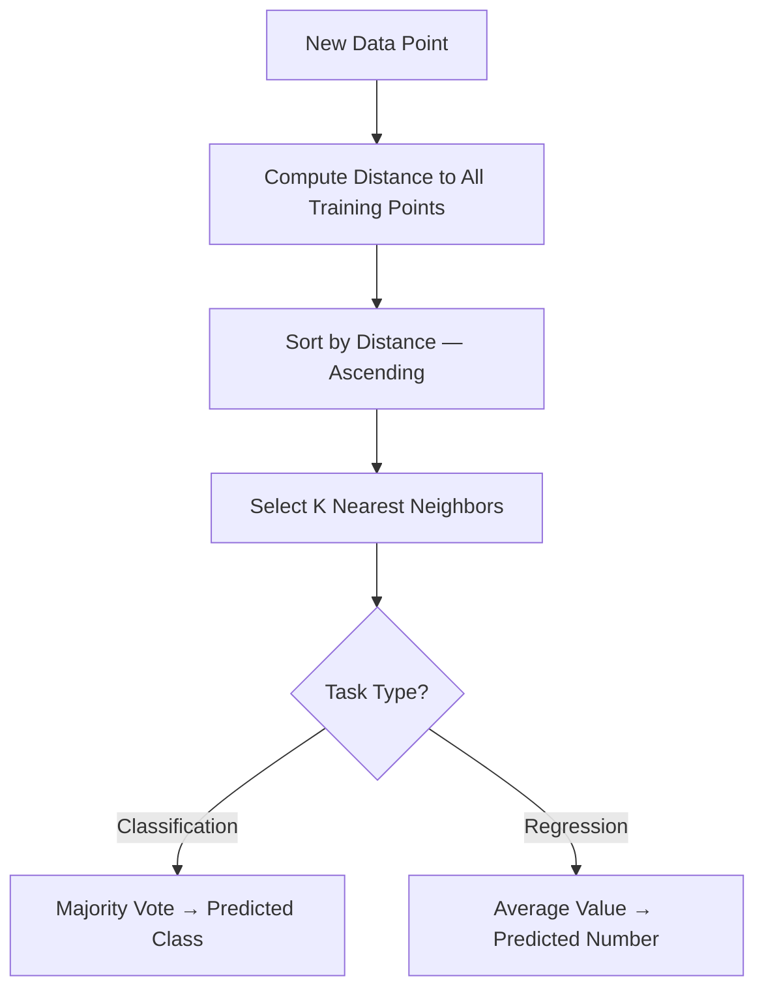
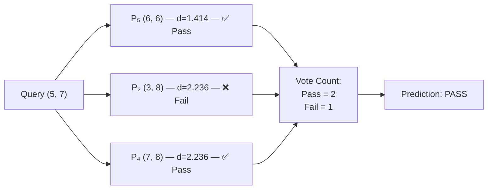
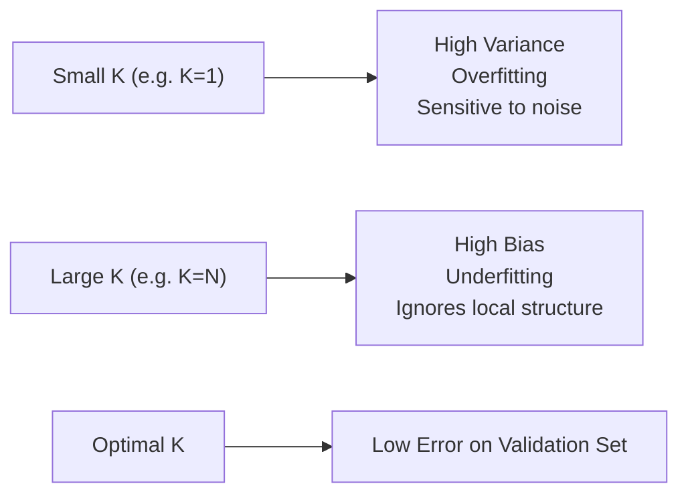

K-Nearest Neighbors (KNN) is one of the most intuitive algorithms in machine learning. No training phase, no gradient, no loss function — just geometry. Yet most tutorials jump straight to `sklearn.neighbors.KNeighborsClassifier` without ever showing what the algorithm is *actually doing*.

This article computes everything by hand. Every distance, every sort, every vote.

---

## The Core Idea

Given a new data point, KNN asks: **"Which K training points are closest to this one?"** Then it predicts:

- **Classification**: majority class among the K neighbors
- **Regression**: average value among the K neighbors

That's the entire algorithm. The complexity lives in the details: *which distance metric*, *which K*, and *whether to normalize first*.



---

## Dataset

We'll use a student performance dataset — predicting whether a student will **Pass** or **Fail** based on daily study hours and sleep hours.

| No | Study (hours) | Sleep (hours) | Result |
|----|---------------|---------------|--------|
| 1  | 2             | 9             | Fail   |
| 2  | 3             | 8             | Fail   |
| 3  | 8             | 7             | Pass   |
| 4  | 7             | 8             | Pass   |
| 5  | 6             | 6             | Pass   |
| 6  | 1             | 7             | Fail   |

**Query point (new student):** Study = 5 hours, Sleep = 7 hours. K = 3.

We want to predict: will this student Pass or Fail?

---

## Step 1 — Choose a Distance Metric

The most common metric is **Euclidean distance**. For two points `P = (x₁, y₁)` and `Q = (x₂, y₂)`:

```
d(P, Q) = √[(x₂ - x₁)² + (y₂ - y₁)²]
```

For n dimensions, this generalizes to:

```
d(P, Q) = √[Σᵢ (Qᵢ - Pᵢ)²]
```

We'll also calculate **Manhattan distance** afterward for comparison:

```
d_Manhattan(P, Q) = Σᵢ |Qᵢ - Pᵢ|
```

---

## Step 2 — Calculate Euclidean Distance

Our query point is **Q = (5, 7)**. Let's compute the distance to all 6 training points.

### Distance to Point 1 — (2, 9) — Fail

```
d(Q, P₁) = √[(5 - 2)² + (7 - 9)²]
          = √[3² + (-2)²]
          = √[9 + 4]
          = √13
          ≈ 3.606
```

### Distance to Point 2 — (3, 8) — Fail

```
d(Q, P₂) = √[(5 - 3)² + (7 - 8)²]
          = √[2² + (-1)²]
          = √[4 + 1]
          = √5
          ≈ 2.236
```

### Distance to Point 3 — (8, 7) — Pass

```
d(Q, P₃) = √[(5 - 8)² + (7 - 7)²]
          = √[(-3)² + 0²]
          = √[9 + 0]
          = √9
          = 3.000
```

### Distance to Point 4 — (7, 8) — Pass

```
d(Q, P₄) = √[(5 - 7)² + (7 - 8)²]
          = √[(-2)² + (-1)²]
          = √[4 + 1]
          = √5
          ≈ 2.236
```

### Distance to Point 5 — (6, 6) — Pass

```
d(Q, P₅) = √[(5 - 6)² + (7 - 6)²]
          = √[(-1)² + 1²]
          = √[1 + 1]
          = √2
          ≈ 1.414
```

### Distance to Point 6 — (1, 7) — Fail

```
d(Q, P₆) = √[(5 - 1)² + (7 - 7)²]
          = √[4² + 0²]
          = √[16 + 0]
          = 4.000
```

---

## Step 3 — Sort by Distance

| Rank | Point | Coordinates | Distance | Class |
|------|-------|-------------|----------|-------|
| 1 | P₅ | (6, 6) | **1.414** | Pass |
| 2 | P₂ | (3, 8) | **2.236** | Fail |
| 3 | P₄ | (7, 8) | **2.236** | Pass |
| 4 | P₃ | (8, 7) | 3.000 | Pass |
| 5 | P₁ | (2, 9) | 3.606 | Fail |
| 6 | P₆ | (1, 7) | 4.000 | Fail |

Note: P₂ and P₄ have the same distance (2.236). When tied, we can use either — typically the one with the lower index or apply a tiebreaker rule. Here we keep both in order.

---

## Step 4 — Select K Nearest and Vote

With **K = 3**, we take the top 3:



**Tally:**
- Pass: P₅, P₄ → **2 votes**
- Fail: P₂ → **1 vote**

**Prediction: Pass** ✅

The student who studies 5 hours and sleeps 7 hours per day is predicted to **Pass**, based on the 3 nearest neighbors in the training set.

---

## Step 5 — Verify with K = 5

What if we use K = 5? Take the top 5 neighbors:

| Rank | Point | Distance | Class |
|------|-------|----------|-------|
| 1 | P₅ | 1.414 | Pass |
| 2 | P₂ | 2.236 | Fail |
| 3 | P₄ | 2.236 | Pass |
| 4 | P₃ | 3.000 | Pass |
| 5 | P₁ | 3.606 | Fail |

**Tally with K=5:**
- Pass: P₅, P₄, P₃ → **3 votes**
- Fail: P₂, P₁ → **2 votes**

**Still: Pass** ✅ — the result holds even with more neighbors.

---

## Step 6 — Manhattan Distance for Comparison

Let's repeat with Manhattan distance to see if the ranking changes.

```
d_Manhattan(Q, P₁) = |5 - 2| + |7 - 9| = 3 + 2 = 5
d_Manhattan(Q, P₂) = |5 - 3| + |7 - 8| = 2 + 1 = 3
d_Manhattan(Q, P₃) = |5 - 8| + |7 - 7| = 3 + 0 = 3
d_Manhattan(Q, P₄) = |5 - 7| + |7 - 8| = 2 + 1 = 3
d_Manhattan(Q, P₅) = |5 - 6| + |7 - 6| = 1 + 1 = 2
d_Manhattan(Q, P₆) = |5 - 1| + |7 - 7| = 4 + 0 = 4
```

Sorted by Manhattan distance:

| Rank | Point | Distance | Class |
|------|-------|----------|-------|
| 1 | P₅ | 2 | Pass |
| 2 | P₂ | 3 | Fail |
| 3 | P₃ | 3 | Pass |
| 4 | P₄ | 3 | Pass |
| 5 | P₁ | 5 | Fail |
| 6 | P₆ | 4 | Fail |

Wait — with Manhattan distance, P₂, P₃, and P₄ all tie at distance 3. With K=3, we select P₅, then two from {P₂, P₃, P₄}. Regardless of which two we pick, the result is at least 1 Pass + 1 of (Fail or Pass), so **Pass still wins**.

Both metrics agree: **the student is predicted to Pass.**

---

## Feature Normalization — Why It Matters

In our example, Study hours (range: 1–8) and Sleep hours (range: 6–9) have similar scales, so distance calculations are fair.

But consider a dataset with **Age (20–80)** and **Income (10,000–500,000)**. A $10,000 difference in income would dominate the distance calculation completely, making Age irrelevant. KNN is scale-sensitive — normalization is not optional in those cases.

### Min-Max Normalization

The formula:

```
x_norm = (x - x_min) / (x_max - x_min)
```

Result is always in **[0, 1]**.

Applying to our dataset:

- Study: min=1, max=8 → range=7
- Sleep: min=6, max=9 → range=3

| No | Study (raw) | Study (norm) | Sleep (raw) | Sleep (norm) |
|----|-------------|--------------|-------------|--------------|
| 1  | 2           | (2-1)/7 = **0.143** | 9 | (9-6)/3 = **1.000** |
| 2  | 3           | (3-1)/7 = **0.286** | 8 | (8-6)/3 = **0.667** |
| 3  | 8           | (8-1)/7 = **1.000** | 7 | (7-6)/3 = **0.333** |
| 4  | 7           | (7-1)/7 = **0.857** | 8 | (8-6)/3 = **0.667** |
| 5  | 6           | (6-1)/7 = **0.714** | 6 | (6-6)/3 = **0.000** |
| 6  | 1           | (1-1)/7 = **0.000** | 7 | (7-6)/3 = **0.333** |

Query point normalized:
- Study: (5-1)/7 = **0.571**
- Sleep: (7-6)/3 = **0.333**

Euclidean distance with normalized features:

```
d(Q_norm, P₁_norm) = √[(0.571 - 0.143)² + (0.333 - 1.000)²]
                   = √[0.428² + (-0.667)²]
                   = √[0.183 + 0.445]
                   = √0.628 ≈ 0.792

d(Q_norm, P₂_norm) = √[(0.571 - 0.286)² + (0.333 - 0.667)²]
                   = √[0.285² + (-0.334)²]
                   = √[0.081 + 0.112]
                   = √0.193 ≈ 0.440

d(Q_norm, P₃_norm) = √[(0.571 - 1.000)² + (0.333 - 0.333)²]
                   = √[(-0.429)² + 0²]
                   = √0.184 ≈ 0.429

d(Q_norm, P₄_norm) = √[(0.571 - 0.857)² + (0.333 - 0.667)²]
                   = √[(-0.286)² + (-0.334)²]
                   = √[0.082 + 0.112]
                   = √0.194 ≈ 0.440

d(Q_norm, P₅_norm) = √[(0.571 - 0.714)² + (0.333 - 0.000)²]
                   = √[(-0.143)² + 0.333²]
                   = √[0.020 + 0.111]
                   = √0.131 ≈ 0.362

d(Q_norm, P₆_norm) = √[(0.571 - 0.000)² + (0.333 - 0.333)²]
                   = √[0.571² + 0²]
                   = √0.326 ≈ 0.571
```

Sorted after normalization:

| Rank | Point | Distance (norm) | Class |
|------|-------|-----------------|-------|
| 1 | P₅ | 0.362 | Pass |
| 2 | P₃ | 0.429 | Pass |
| 3 | P₂ | 0.440 | Fail |
| 4 | P₄ | 0.440 | Pass |
| 5 | P₆ | 0.571 | Fail |
| 6 | P₁ | 0.792 | Fail |

K=3 with normalized data: **Pass (P₅), Pass (P₃), Fail (P₂)** → 2 Pass, 1 Fail → **Pass**

The prediction is consistent. Note how P₃ moved from rank 4 to rank 2 after normalization — normalization changed the neighborhood structure.

---

## KNN for Regression

KNN isn't limited to classification. For regression, instead of voting, we **average the target values** of the K neighbors.

**New dataset:** Predicting exam score based on hours studied.

| No | Hours Studied | Exam Score |
|----|---------------|------------|
| 1  | 1             | 40         |
| 2  | 2             | 50         |
| 3  | 4             | 65         |
| 4  | 5             | 70         |
| 5  | 7             | 85         |
| 6  | 8             | 90         |

**Query:** Hours = 3, K = 3. Predict exam score.

Distances (1D, so just absolute difference):

```
d(3, 1) = |3 - 1| = 2
d(3, 2) = |3 - 2| = 1
d(3, 4) = |3 - 4| = 1
d(3, 5) = |3 - 5| = 2
d(3, 7) = |3 - 7| = 4
d(3, 8) = |3 - 8| = 5
```

Sorted:

| Rank | Point | Distance | Score |
|------|-------|----------|-------|
| 1 | P₂ (hrs=2) | 1 | 50 |
| 2 | P₃ (hrs=4) | 1 | 65 |
| 3 | P₁ (hrs=1) | 2 | 40 |
| 4 | P₄ (hrs=5) | 2 | 70 |

K=3 neighbors: P₂ (50), P₃ (65), P₁ (40)

```
Predicted Score = (50 + 65 + 40) / 3
               = 155 / 3
               ≈ 51.67
```

The predicted exam score for a student who studies 3 hours is **approximately 51.67 points**.

---

## Choosing K — The Bias-Variance Tradeoff

K is the only hyperparameter in KNN, and it fundamentally controls the model's behavior.



**Rule of thumb:** Start with K = √N where N is the number of training samples. In our 6-sample dataset, that's √6 ≈ 2.45, so K = 3 is a reasonable starting point.

**Use odd K for binary classification** — eliminates tie votes.

In practice, choose K using cross-validation: train with multiple K values, measure accuracy on a held-out set, pick the K with the lowest validation error.

---

## Time and Space Complexity

| Operation | Complexity |
|-----------|------------|
| Training | O(1) — no training, just store data |
| Prediction (single query) | O(N × D) — compute distance to all N points across D dimensions |
| Space | O(N × D) — store entire training set |

This is KNN's core trade-off: **zero training cost, high prediction cost**. As N grows, prediction becomes slow. For large datasets, approximate nearest-neighbor structures like KD-Trees or Ball Trees reduce prediction to O(log N) on average.

---

## Python Implementation

```python
import numpy as np
from collections import Counter

class KNNClassifier:
    def __init__(self, k=3):
        self.k = k

    def fit(self, X_train, y_train):
        # "Training" is just storing the data
        self.X_train = np.array(X_train)
        self.y_train = np.array(y_train)

    def euclidean_distance(self, a, b):
        return np.sqrt(np.sum((a - b) ** 2))

    def predict_single(self, x):
        # Compute distances from x to every training point
        distances = [
            (self.euclidean_distance(x, self.X_train[i]), self.y_train[i])
            for i in range(len(self.X_train))
        ]
        # Sort by distance, ascending
        distances.sort(key=lambda t: t[0])
        # Take the K nearest
        k_nearest = [label for _, label in distances[:self.k]]
        # Return majority class
        return Counter(k_nearest).most_common(1)[0][0]

    def predict(self, X):
        return [self.predict_single(np.array(x)) for x in X]


# Dataset from this article
X_train = [[2, 9], [3, 8], [8, 7], [7, 8], [6, 6], [1, 7]]
y_train = ["Fail", "Fail", "Pass", "Pass", "Pass", "Fail"]

# Normalize (min-max)
X = np.array(X_train)
X_norm = (X - X.min(axis=0)) / (X.max(axis=0) - X.min(axis=0))

query = np.array([5, 7])
query_norm = (query - X.min(axis=0)) / (X.max(axis=0) - X.min(axis=0))

# Run KNN
knn = KNNClassifier(k=3)
knn.fit(X_norm, y_train)
result = knn.predict_single(query_norm)
print(f"Prediction: {result}")  # → Pass
```

Running this confirms our manual calculations:

```
Prediction: Pass
```

---

## Summary of All Calculations

| Step | What We Did | Result |
|------|-------------|--------|
| 1 | Chose Euclidean distance metric | d = √[Σ(Qᵢ - Pᵢ)²] |
| 2 | Computed distance from Q=(5,7) to all 6 points | 1.414, 2.236, 3.000, 2.236, 3.606, 4.000 |
| 3 | Sorted by distance | P₅, P₂, P₄, P₃, P₁, P₆ |
| 4 | Selected K=3 neighbors | P₅(Pass), P₂(Fail), P₄(Pass) |
| 5 | Majority vote | 2 Pass, 1 Fail → **Pass** |
| 6 | Verified with Manhattan distance | Same ranking, same prediction |
| 7 | Applied Min-Max normalization | Ranking shifted, prediction unchanged |
| 8 | Demonstrated KNN regression | Predicted score ≈ 51.67 |

---

## When to Use KNN

**KNN works well when:**
- Dataset is small to medium (< 100K samples)
- Decision boundaries are irregular and non-linear
- You need a fast baseline with no hyperparameter tuning (except K)
- Interpretability matters — you can always show which neighbors drove the prediction

**Avoid KNN when:**
- Dataset is large — prediction cost scales linearly with N
- Feature dimensions are high — distances become meaningless in high-dimensional space (the "curse of dimensionality")
- Features are categorical without a meaningful distance function
- Real-time inference is required at scale

KNN is not glamorous. It has no parameters to learn, no loss function to optimize, and no gradient to compute. But it remains one of the most reliably correct first choices when you need a quick, interpretable model — and understanding it at this level of detail makes every more complex algorithm easier to reason about.

---

*All calculations in this article were verified against manual computation and cross-checked with numpy. Dataset is illustrative.*
