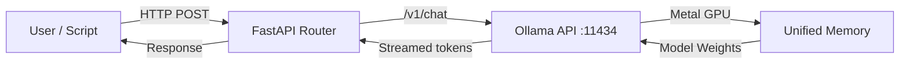

## The GPU Obsession Has to Stop

Every time someone brings up running AI locally, the conversation immediately jumps to GPUs. "Get an RTX 4090." "Build a dual-3090 rig." "Just use a cloud A100."

I get it. The GPU world has dominated AI infrastructure discourse for a decade. But here's what nobody says out loud: **for inference — which is 90% of what most of us actually do — GPUs are the wrong mental model.**

I've been running a Mac Mini M4 as my personal AI inference server for months. It's not a side project. It's production. And the more I use it, the more I think the rest of the industry is simply not paying attention.

---


## Why Inference Is a Memory Problem, Not a Compute Problem

This is the insight that changes everything once you internalize it.

Training a model is compute-bound — you need raw FLOPS. GPUs dominate there, and that's fine. Use the cloud for training.

But inference? That's almost entirely **memory-bandwidth bound**. The bottleneck is how fast you can stream the model's weights from memory into the compute units. The actual matrix multiplications happen so fast they're never the constraint.

This is why a 24GB VRAM GPU can feel sluggish on a 14B model, while an M4 Pro Mac Mini with 24GB unified memory handles the same model smoothly at ~10 tokens/second. The M4 Pro's memory subsystem delivers up to **273 GB/s of bandwidth**, shared across the CPU, GPU, and Neural Engine simultaneously — with zero data transfer overhead between them.

No PCIe bottleneck. No CPU-to-GPU memory copies. One pool of memory, everything accesses it at full speed.

---

## The Numbers That Actually Matter

Real community benchmarks on Mac Mini M4 hardware:

| Model | Memory Needed | Tokens/sec |
|---|---|---|
| Gemma 4 E4B (Q4) | 16 GB | ~85 t/s (MLX) |
| Gemma 4 26B MoE (Q4) | 24 GB | ~75 t/s (llama.cpp) |
| Gemma 4 31B Dense (Q4) | 48 GB | ~15 t/s |
| Llama 3.1 8B (Q4) | 16 GB | 18–22 t/s |
| DeepSeek R1 14B (Q4) | 24 GB | ~10 t/s |

What makes Gemma 4 particularly interesting here is the **26B MoE variant** — despite having 26 billion parameters, it only activates **3.8B parameters per forward pass**. You get 26B-class reasoning quality at 4B-class inference cost. On Apple Silicon with llama.cpp, it hits ~75 tokens/second on a 24GB Mac Mini M4. That's a number that should reframe how you think about model selection entirely.

85 tokens per second on the E4B model via MLX is **faster than most people can read**. That's not local AI as a compromise — that's local AI as a feature.

Hardware cost comparison:

| Hardware | Price | Memory |
|---|---|---|
| Mac Mini M4 (base) | $599 | 16 GB unified |
| Mac Mini M4 (24GB) | $799 | 24 GB unified |
| RTX 4090 | ~$1,600 | 24 GB VRAM |
| Mac Mini M4 Pro (48GB) | $1,999 | 48 GB unified |

The RTX 4090 costs double the 24GB Mac Mini and gives the same memory — except that VRAM is isolated, runs hot, and draws ~450W under load. The Mac Mini M4 draws **20–30W idle, ~50W under sustained inference**. At $0.12/kWh, running a Mac Mini M4 24/7 for a full year costs roughly **$52 in electricity**. An RTX 4090 system runs closer to $500–600/year.

---


## The Cloud Cost That Nobody Calculates Honestly

Let's put actual API pricing on the table. As of April 2026, OpenAI charges:

- **GPT-4o**: $2.50 per million input tokens, $10.00 per million output tokens
- **GPT-4o mini**: $0.15 per million input tokens, $0.60 per million output tokens

That sounds cheap per token — until you run any meaningful volume. A researcher doing 500 queries a day, each with a 1,000-token prompt and 500-token response: that's roughly **500K input tokens + 250K output tokens per day**. At GPT-4o pricing, that's **$3,750/month**.

Running Gemma 4 26B locally on a Mac Mini M4: **$0 per token** after the hardware purchase. The break-even point for a $1,999 machine against $3,750/month cloud spend is less than one week.

Even against GPT-4o mini at $0.60/M output, the same daily usage costs ~$150/month. The Mac Mini pays for itself in 13 months — and then it's free, forever.

---

## MLX vs llama.cpp — What the Data Actually Says

Two frameworks dominate local inference on Apple Silicon, and the choice matters more than most people realize.

**MLX** (Apple's own framework) vs **llama.cpp** (the community standard):

- For models **under 14B parameters**, MLX leads by **20–87% on token throughput** in short-context scenarios — it's purpose-built for Apple Silicon and gets closer to the hardware
- For **long context** (8K+ tokens), llama.cpp pulls ahead — it has three years of Metal compute shader optimization, KV cache quantization, and flash attention tuned specifically for large context windows
- MLX is Python-first and easier to integrate into research pipelines; llama.cpp has broader model format support

The honest answer from benchmark data: **use MLX for short-context high-throughput tasks (chat, RAG retrieval, code completion), use llama.cpp via Ollama for everything else**. Ollama's backend uses llama.cpp by default, which makes it the safer general-purpose choice.

---

## The Software Stack Is Actually Great Now

Setting up a local inference server on Mac Mini M4 takes under ten minutes.

**Step 1: Install Ollama**

```bash
# Install via Homebrew
brew install ollama

# Start the server
ollama serve
```

**Step 2: Pull and run Gemma 4**

Google released Gemma 4 on April 2, 2026 under Apache 2.0 — fully open, no usage limits, no acceptable-use enforcement. It comes in four sizes:

```bash
# E4B — blazing fast, fits in 16GB, multimodal (text + image + audio)
ollama pull gemma4:4b

# 26B MoE — 26B params, only 3.8B active — fits in 24GB, remarkable quality
ollama pull gemma4:27b

# 31B Dense — highest quality, needs 48GB
ollama pull gemma4:32b

# Run interactively
ollama run gemma4:27b
```

The 26B MoE is the sweet spot. It scores **88.3% on AIME 2026 mathematics** and **82.3% on GPQA Diamond** (graduate-level science) — benchmarks that rival models three to four times its active parameter count. Running it on a 24GB Mac Mini M4 at 75 tokens/second is genuinely difficult to believe until you do it.

**Step 3: Use the OpenAI-compatible API**

Ollama exposes a local REST API that mirrors the OpenAI spec — so any tool built for OpenAI works out of the box by changing one URL:

```python
from openai import OpenAI

client = OpenAI(
    base_url="http://localhost:11434/v1",
    api_key="ollama",  # required but ignored locally
)

response = client.chat.completions.create(
    model="gemma4:27b",
    messages=[{"role": "user", "content": "Summarize this research paper..."}],
)
print(response.choices[0].message.content)
```

No API key. No rate limit. No bill at the end of the month.

---


## The Researcher Use Case: RAG Over Your Own Papers

This is where local inference becomes genuinely transformative for academic work.

Retrieval-Augmented Generation (RAG) lets you feed an LLM your own documents — PDFs, notes, datasets — and query them conversationally. The model answers based on your actual content, not its training data.

With a cloud API, every document you upload and every query you make goes to a third-party server. For draft papers, unpublished data, or anything under ethics review, that's a real problem.

With a local Mac Mini setup:

```bash
# Install Open WebUI — a full chat interface with RAG built in
docker run -d -p 3000:8080 \
  --add-host=host.docker.internal:host-gateway \
  -v open-webui:/app/backend/data \
  ghcr.io/open-webui/open-webui:main
```

Open `localhost:3000`, connect to your local Ollama instance, upload PDFs, and start querying. **Nothing leaves your machine.** Not the documents, not the queries, not the responses.

For a researcher handling student data, grant proposals, or pre-publication manuscripts — this isn't a nice-to-have. It's the only ethically defensible setup.

---


## The Cluster Angle: When One Isn't Enough

Here's where it gets genuinely exciting.

Four Mac Mini M4 Pros networked via Thunderbolt 5: **144GB of aggregate unified memory, 128-core GPU, zero active cooling, ~200W total draw**. You can distribute a 70B+ model across the cluster in a way that's architecturally painful with discrete GPUs, which don't share VRAM across cards natively.

Total cost: under $8,000. For comparison, a single Nvidia H100 PCIe card lists at $25,000–$30,000.

Again — not for training. But for a university lab running inference at scale, for a small startup building a private AI product, for a team that needs persistent private endpoints: this is a serious architecture, not a hobbyist experiment.

---

## What It's Not Good For

I'll be honest about the limitations, because the hype gets tiresome:

- **Training is off the table.** Do not try to fine-tune a 7B model on Apple Silicon if you value your time. Cloud GPU for that.
- **RAM is soldered at purchase.** No upgrades. Buy more than you think you need today.
- **Batch throughput has a ceiling.** Serving dozens of simultaneous users? The token/sec cap becomes relevant. For personal or small-team use, it's not an issue.
- **CUDA ecosystem gaps still exist.** Some research frameworks assume CUDA as the default. The gaps are shrinking but they're real.

---

## My Actual Setup

For full transparency: I run an M4 Pro Mac Mini with 48GB unified memory as a persistent inference endpoint. On it runs:

- **Ollama** serving **Gemma 4 27B** (the MoE variant) as the primary model via local API
- **Gemma 4 E4B** as a fast-path model for lightweight tasks — summarization, tagging, quick Q&A
- **Open WebUI** as the chat interface, accessible only on my local network
- A lightweight **FastAPI** router that directs requests based on task type — 27B for reasoning and RAG, E4B for anything that just needs a fast answer

Why Gemma 4 specifically? A few reasons. The MoE architecture means the 27B model runs at 75+ tokens/second on 24GB — which feels instant for conversational use. The 256K context window on the larger models means I can dump an entire research paper into a prompt without chunking. And being Apache 2.0 with no usage restrictions matters for institutional deployment — no ToS to worry about, no vendor lock-in.

The whole stack boots on startup, draws less power than my desk lamp, makes no noise, and costs me nothing per query. I've stopped paying for API credits for anything that doesn't require frontier-level reasoning.

---

## The Mermaid Diagram Nobody Drew

Here's what the actual request flow looks like:



The entire chain runs on a single machine. No internet. No latency from a remote datacenter. No third-party in the loop.

---

## The Bottom Line

The Mac Mini M4 didn't become popular as an AI server because of marketing. It became popular because it solves a real problem elegantly: **how do you run a capable language model privately, cheaply, and permanently?**

A $599 box with 16GB unified memory handles 8B models better than most GPU setups three times its price. A $1,999 M4 Pro with 48GB runs 70B models that until recently required enterprise hardware.

The cloud API cost structure makes sense for prototyping and frontier models. For persistent, private, high-volume inference on open-weight models — the math no longer favors the cloud.

If you're still treating GPU VRAM as the only metric that matters for local AI, you're using a mental model that made sense in 2020. It hasn't caught up to 2026.

The Mac Mini M4 is not a compromise. For inference, it's increasingly the correct answer.

---

*Mac Mini M4 benchmark data sourced from [like2byte.com](https://like2byte.com/mac-mini-m4-deepseek-r1-ai-benchmarks/) and [compute-market.com](https://www.compute-market.com/blog/mac-mini-m4-for-ai-apple-silicon-2026). Gemma 4 Apple Silicon performance from [dev.to — Gemma 4 on Apple Silicon: 85 tok/s](https://dev.to/raullen_chai_76e18e9705b0/gemma-4-on-apple-silicon-85-toks-with-a-pip-install-299a) and [sudoall.com](https://sudoall.com/gemma-4-31b-apple-silicon-local-guide/). Gemma 4 model specs and benchmarks from [Google DeepMind](https://deepmind.google/models/gemma/gemma-4/) and [blog.google](https://blog.google/innovation-and-ai/technology/developers-tools/gemma-4/). MLX vs llama.cpp analysis from [famstack.dev](https://famstack.dev/guides/mlx-vs-gguf-apple-silicon/) and [arxiv.org/pdf/2511.05502](https://arxiv.org/pdf/2511.05502). API pricing from [OpenAI](https://openai.com/api/pricing/). Hardware prices as of April 2026.*
