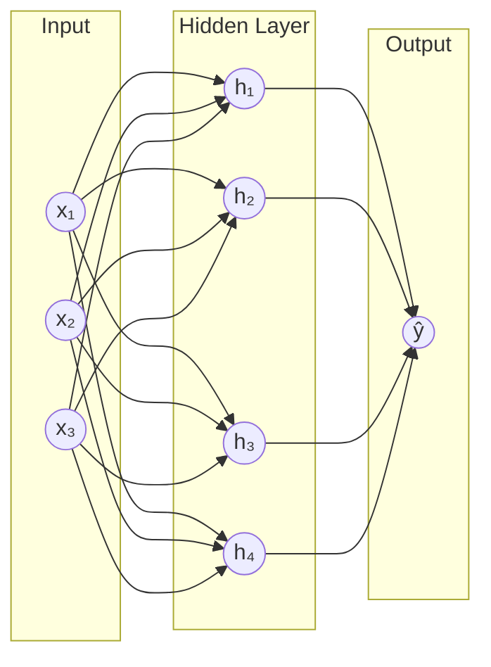
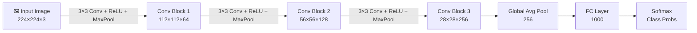
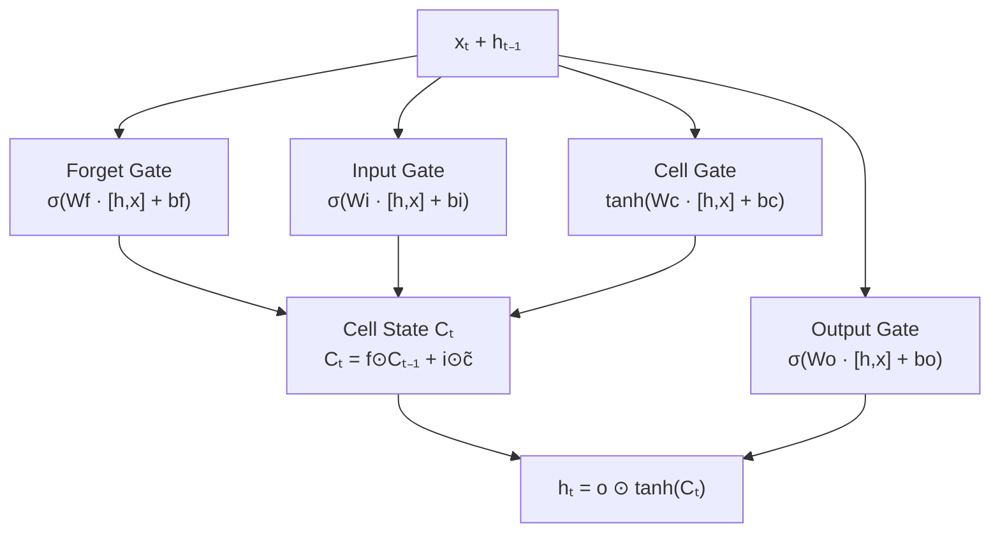
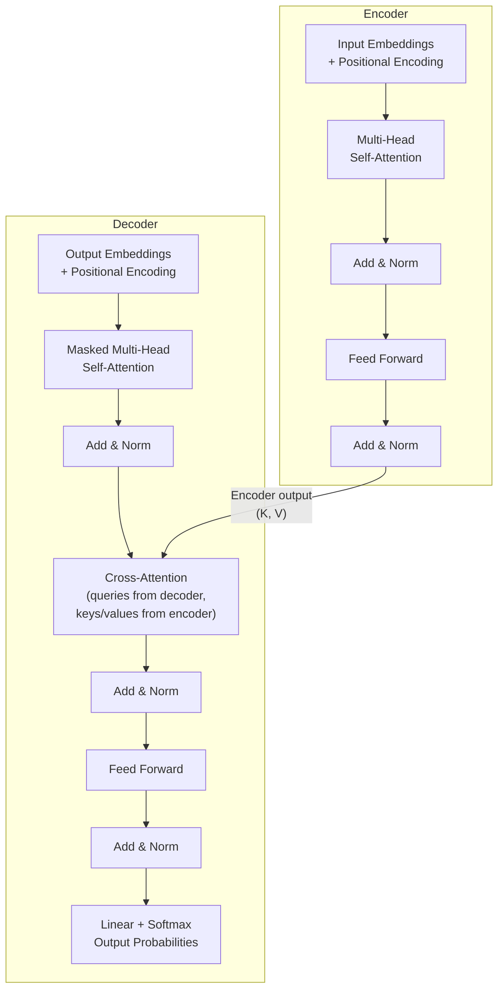
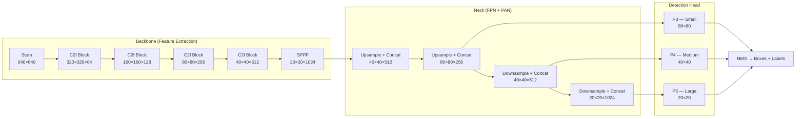
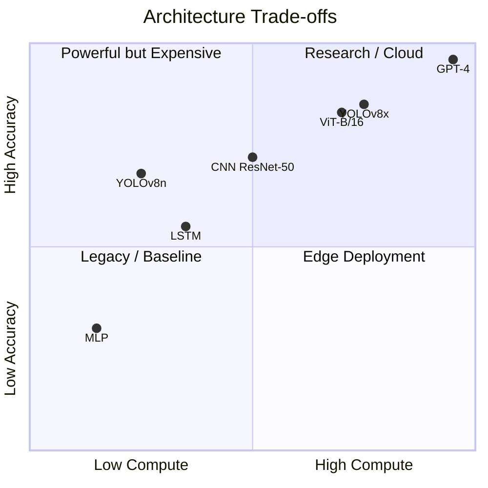
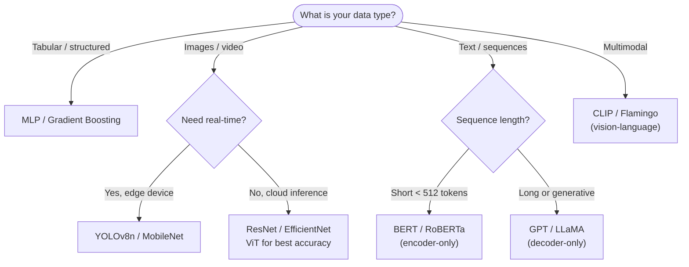

Understanding neural network architectures becomes much clearer when you can *see* the data flow. This post walks through the major families of deep learning architectures using diagrams, with practical notes on when to use each one.

## 1. The Feedforward Network (MLP)

The most fundamental architecture. Data flows in one direction — input → hidden layers → output. No cycles, no memory.

**When to use:** Tabular data, regression, simple classification. MLPs struggle with spatial structure (images) or sequential data (text) because they treat every input feature independently.

## 2. Convolutional Neural Network (CNN)

CNNs exploit **spatial locality** — nearby pixels are correlated. A kernel slides over the image, sharing weights across positions. This dramatically reduces parameters compared to a fully connected approach.

**Feature hierarchy:** Early layers detect edges → mid layers detect textures → deep layers detect semantic objects. This hierarchical feature extraction is why CNNs work so well on images.

## 3. Recurrent Neural Network (RNN) & LSTM

For sequential data, we need **memory**. RNNs pass a hidden state `hₜ` from one time step to the next.

```mermaid
flowchart LR
    x0["x₀\n(token 1)"]
    x1["x₁\n(token 2)"]
    x2["x₂\n(token 3)"]
    x3["x₃\n(token 4)"]

    rnn0["RNN Cell"]
    rnn1["RNN Cell"]
    rnn2["RNN Cell"]
    rnn3["RNN Cell"]

    h0["h₀"] --> rnn0
    x0 --> rnn0 --> rnn1
    x1 --> rnn1 --> rnn2
    x2 --> rnn2 --> rnn3
    x3 --> rnn3

    rnn0 -->|"y₀"| out0["output"]
    rnn3 -->|"y₃"| out3["output"]
```

The classic RNN suffers from **vanishing gradients** over long sequences. The LSTM solves this with three gates:

## 4. The Transformer Architecture

Transformers replaced RNNs as the dominant architecture for sequence tasks. The key innovation is **self-attention** — every token attends to every other token in parallel.

**Attention formula:** `Attention(Q, K, V) = softmax(QKᵀ / √dₖ) · V`

The `√dₖ` scaling prevents dot products from growing too large in high dimensions, which would push softmax into saturation.

## 5. YOLO Detection Pipeline

For real-time object detection, YOLO (You Only Look Once) processes the entire image in a single forward pass — no region proposal step.

The multi-scale head is critical: **P3 detects small objects**, **P4 handles medium**, **P5 catches large objects**. The FPN (top-down) brings semantic richness to small feature maps, while PAN (bottom-up) brings spatial precision to large feature maps.

## Architecture Comparison

## Choosing the Right Architecture

The right architecture depends on your **data modality**, **compute budget**, and **latency requirements**. For most research prototypes, start with a pretrained backbone and fine-tune — training from scratch is rarely necessary.
