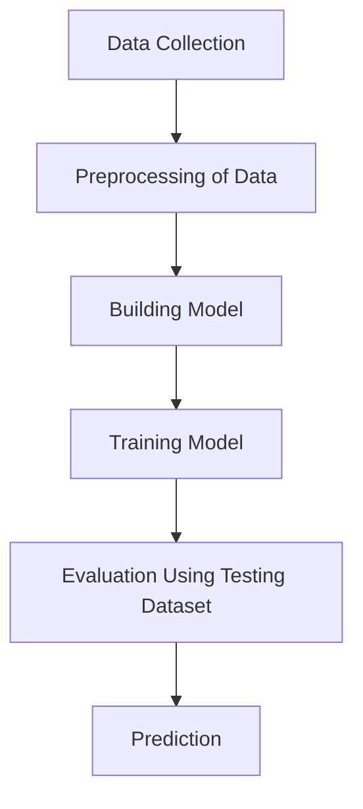

The general goal of machine learning is to train a model to recognize patterns in any type of historical data so that it can repeat those patterns on similar data in the future. Here’s a diagram outlining the basic machine learning process :

  

# Introduction
In this blog, we will go through the workflow of a machine learning project, which includes all of the stages necessary to develop a professional machine learning project from the ground up.

## Understanding the machine learning workflow
- Gathering data
- Data pre-processing
- Researching the model that will be best for the type of data
- Training and testing the model
- Evaluation
